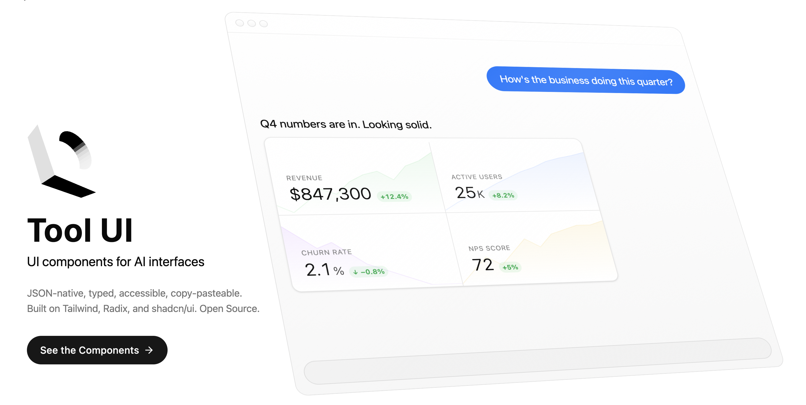
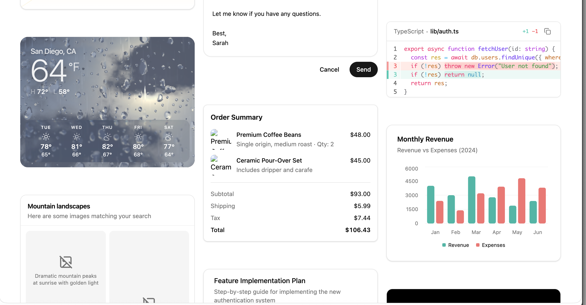
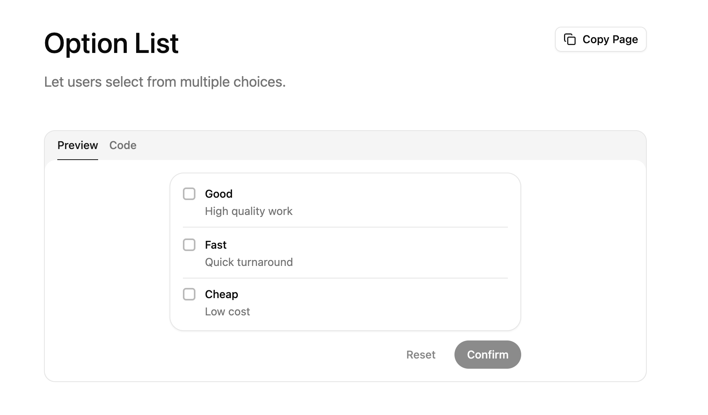
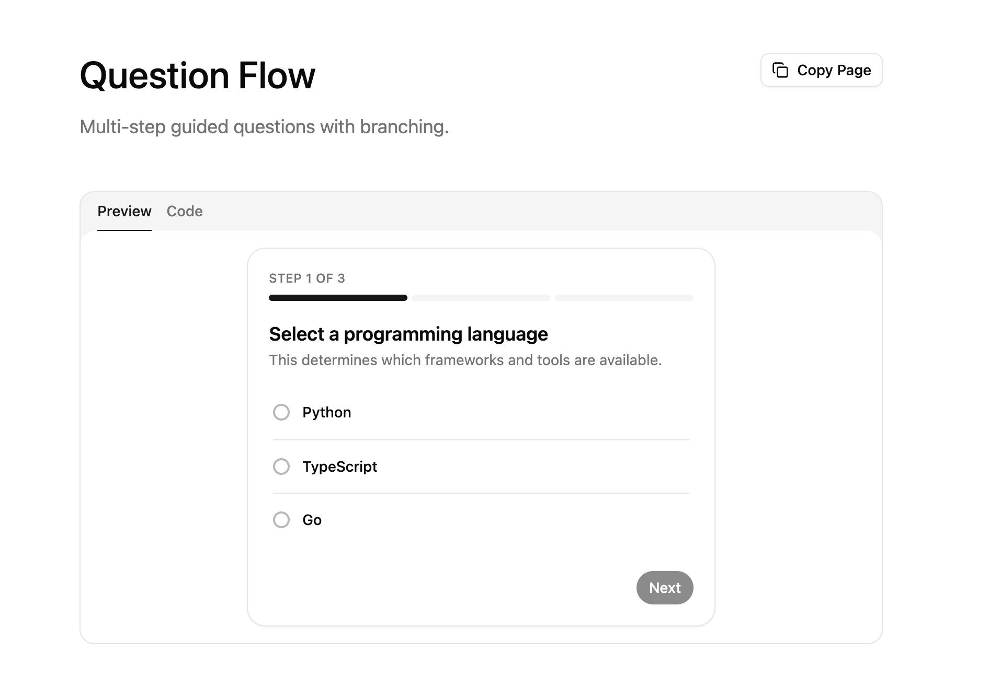

# Tool UI

<p>
  
</p>

Tool UI is a copy/paste component library for AI assistants.

When a model calls a tool, most apps dump JSON into the chat. Tool UI turns those payloads into purpose-built interfaces such as approvals, forms, tables, charts, media cards, and receipts so users can understand and act inline.

**[tool-ui.com](https://tool-ui.com)** | [Docs](https://tool-ui.com/docs/overview) | [Gallery](https://tool-ui.com/docs/gallery) | [Quick Start](https://tool-ui.com/docs/quick-start)

## What You Get

- 25+ Tool UI components organized by interaction role (decision, input, display, progress, media)
- Serializable schemas and safe parse helpers for model/tool payloads
- Runtime integration patterns for assistant-ui and manual renderers
- Presets for realistic payload examples and docs previews
- A docs site and gallery that mirror production usage patterns

## Image Examples

<p>
  
</p>

<p>
  
  
</p>

## Component Coverage

- **Decision/Confirmation**: Approval Card, Order Summary, Message Draft, Option List
- **Input/Configuration**: Parameter Slider, Preferences Panel, Question Flow
- **Display/Artifacts**: Data Table, Chart, Citation, Link Preview, Stats Display, Code Block, Code Diff, Terminal
- **Media/Creative**: Image, Image Gallery, Video, Audio, Instagram Post, LinkedIn Post, X Post
- **Progress/Execution**: Plan, Progress Tracker, Weather Widget

Browse all components in the [Gallery](https://tool-ui.com/docs/gallery).

## Local Development

```bash
pnpm install
pnpm dev
```

Useful local routes:

- `http://localhost:3000/docs/quick-start` integration walkthrough
- `http://localhost:3000/docs/gallery` component browsing and previews
- `http://localhost:3000/playground` interactive runtime prototyping
- `http://localhost:3000/docs/changelog` release and update notes

## Validation

```bash
pnpm verify:ci
```

If registry checks fail, regenerate artifacts and stage them:

```bash
pnpm registry:build
git add public/r
```

## License

MIT License. See [LICENSE](LICENSE) for details.
