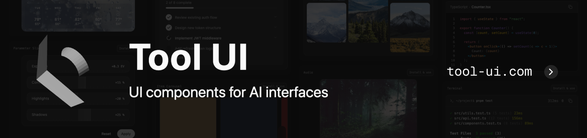
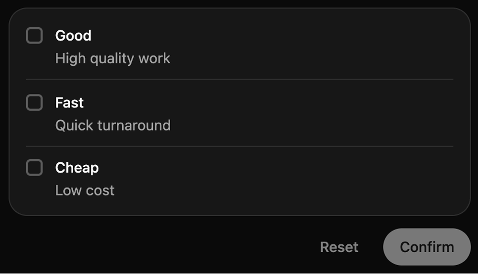
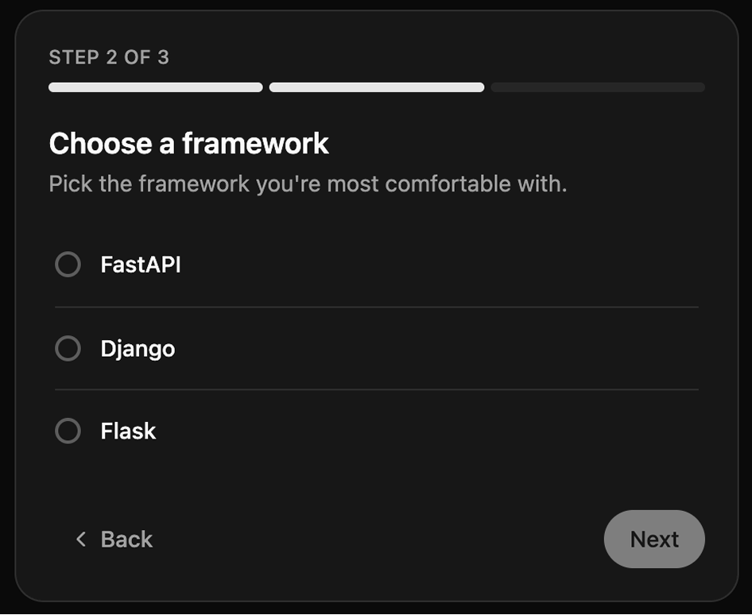
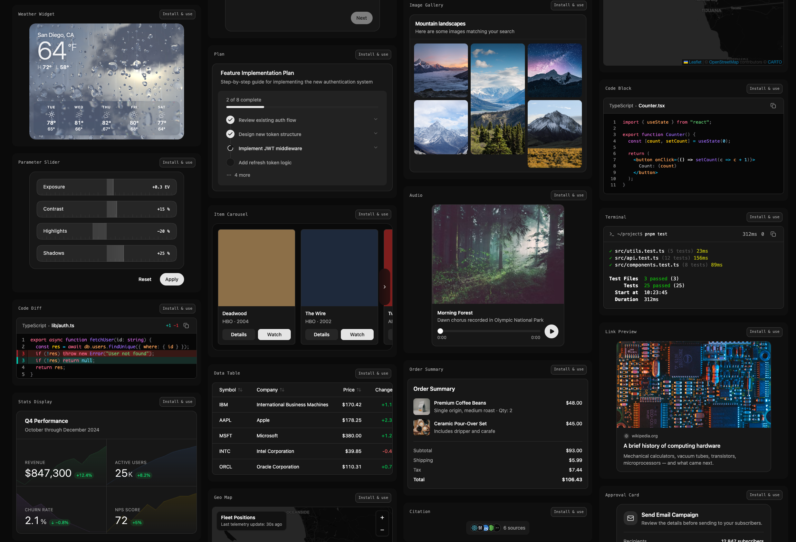

Copy/paste React components for rendering tool calls in AI chat interfaces. Built by [assistant-ui](https://github.com/assistant-ui).

**[Docs](https://tool-ui.com/docs/overview)** · **[Gallery](https://tool-ui.com/docs/gallery)** · **[Quick Start](https://tool-ui.com/docs/quick-start)**

When a model calls a tool, most apps dump raw JSON into the conversation. These components turn tool payloads into interactive UI like approvals, forms, tables, charts, and media cards so users can understand and act without leaving the chat.

## Featured Components

<table border="0" cellspacing="0" cellpadding="0">
  <tr>
    <td valign="top" width="50%">
      <strong><a href="https://www.tool-ui.com/docs/option-list">Option List</a></strong> 
      Let users select from multiple choices  
      
    </td>
    <td valign="top" width="50%">
      <strong><a href="https://www.tool-ui.com/docs/question-flow">Question Flow</a></strong> 
      Multi-step guided questions with branching  
      
    </td>
  </tr>
</table>

## Why Tool UI?

- **Copy/paste, not install** — shadcn/ui model. Components live in your codebase. No dependency lock-in.
- **Schema-validated** — Every component has a Zod schema. Parse tool output, render when valid, fail safely when not.
- **Interactive with receipts** — Components aren't just displays. Users make choices that flow back to the assistant. Choices persist as receipts.
- **Built on shadcn/ui** — Radix primitives, Tailwind styling, your theme. No new design system to learn.

## Components

- **Progress**: Plan, Progress Tracker
- **Input**: Option List, Parameter Slider, Preferences Panel, Question Flow
- **Display**: Citation, Geo Map, Item Carousel, Link Preview, Stats Display, Terminal, Weather Widget
- **Artifacts**: Chart, Code Block, Code Diff, Data Table, Instagram Post, LinkedIn Post, Message Draft, X Post
- **Confirmation**: Approval Card, Order Summary
- **Media**: Audio, Image, Image Gallery, Video

Each component includes a Zod schema for payload validation and presets for realistic example data. Browse them all in the [Gallery](https://tool-ui.com/docs/gallery).

## License

MIT License. See [LICENSE](LICENSE.md) for details.
